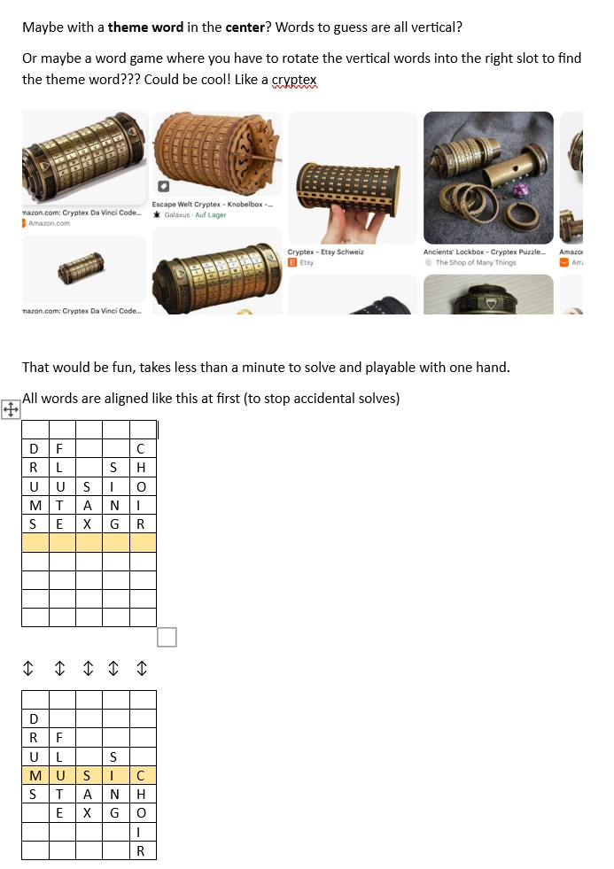

# personal_project_1_Cryptex
my first solo project to get out of tutorial hell, part of my boot.dev curriculum

## The Motivation

I love those daily brain teaser games, especially the word-logic related ones. Wend, crossclimb, mini-crosswords, spelling bee. Somehow, they feel really intuitive for me.

So why not try to make my own? 

## The Idea

I was thinking of just making an automatic mini-crossword generator and mess with matrixes in python but then, through some conversation with AI, i noticed that there would be a cool game mechanic in arranging all words vertically and sliding them up or down to look a horizontal theme word into place (all vertical words are part of the theme, to help the player).

the end result would look a lot like a cryptex machine and hence the name ;D

This project really started with a word file and a table like this: 

## The code

you think i know how to do this? see you in 40 hours

## next steps

1. make it pretty
2. put it online
3. get user base
4. sell to NY Times or LinkedIn
5. profit